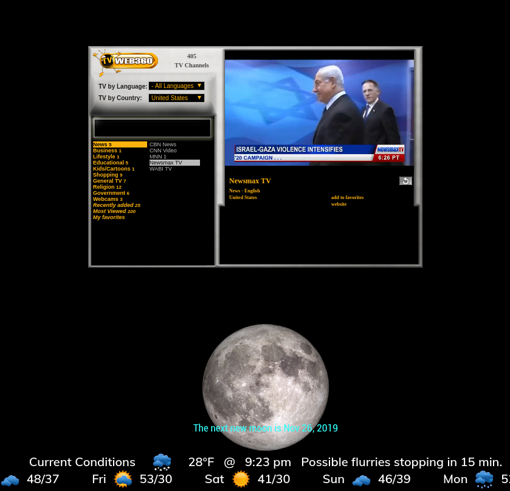

## MMM-TV

Embedded TV Web360 widget

Channels are limited but it's an easy way to have some TV content on your mirror.

## Examples



## Installation

* `git clone https://github.com/mykle1/MMM-TV` into the `~/MagicMirror/modules` directory.

## Config.js entry and options

```
    {
           disabled: false,
           module: 'MMM-TV',
           position: 'middle_center',
    },
```

## Requires the ability to click or touch

* Some channels must be unmuted.
* You can choose language and country.

### Do NOT click the following message in the module

* This channel opens in a new window
* Click here to access content
